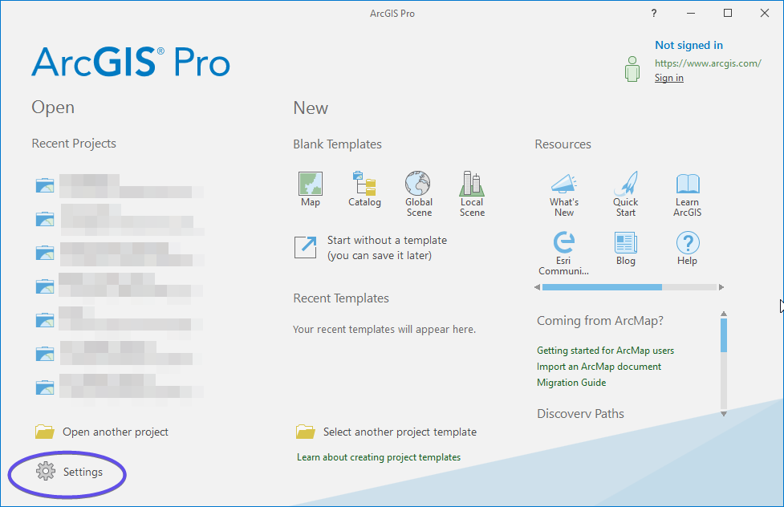
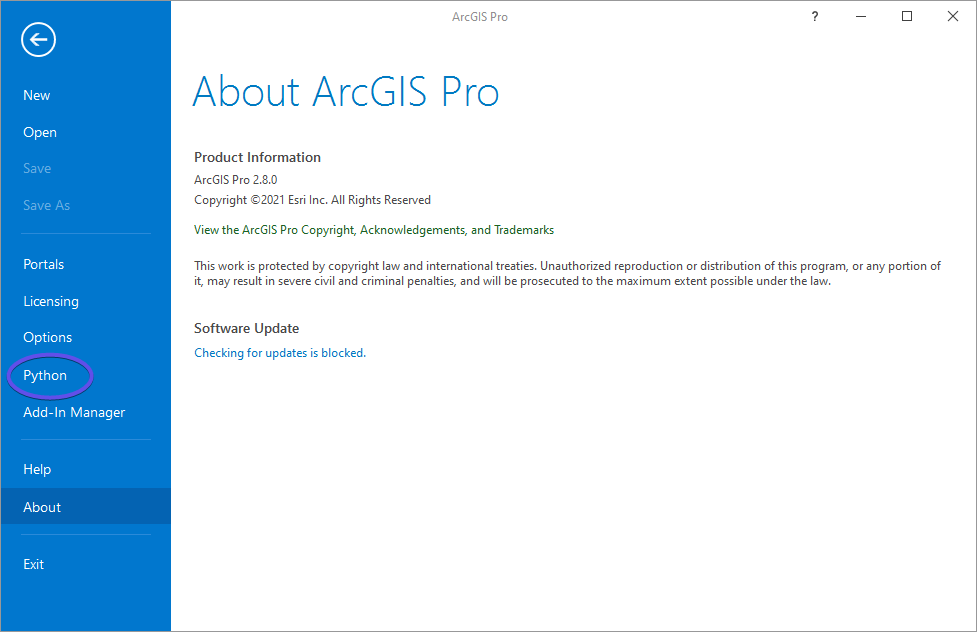
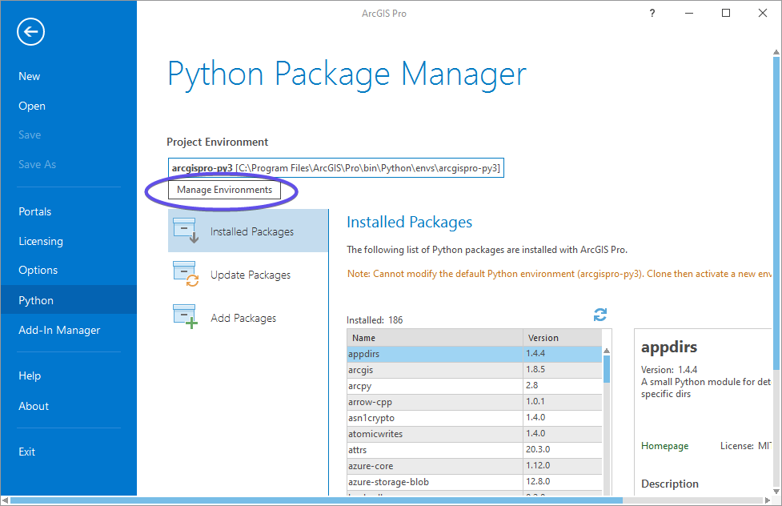
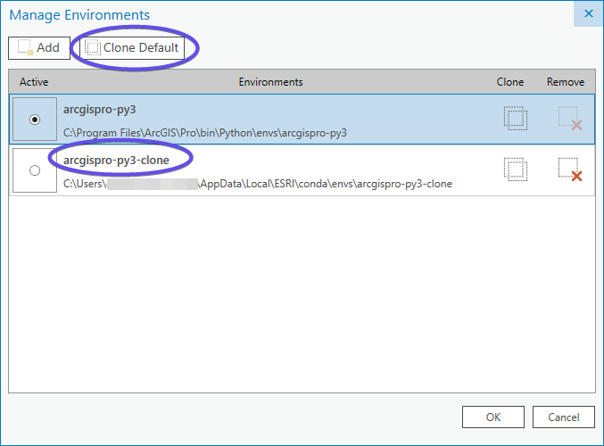
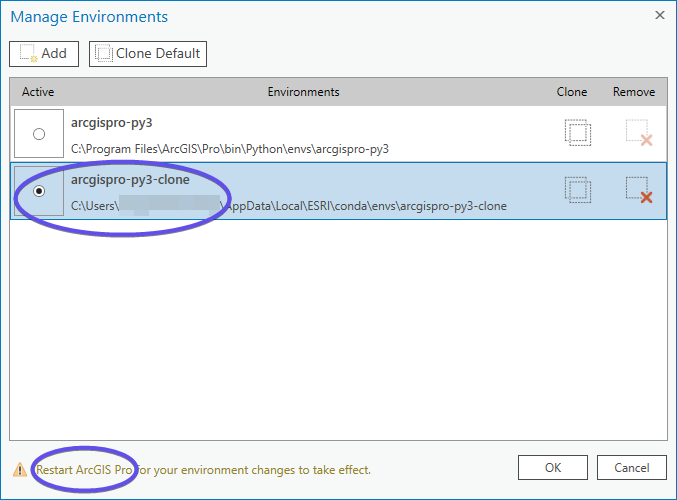
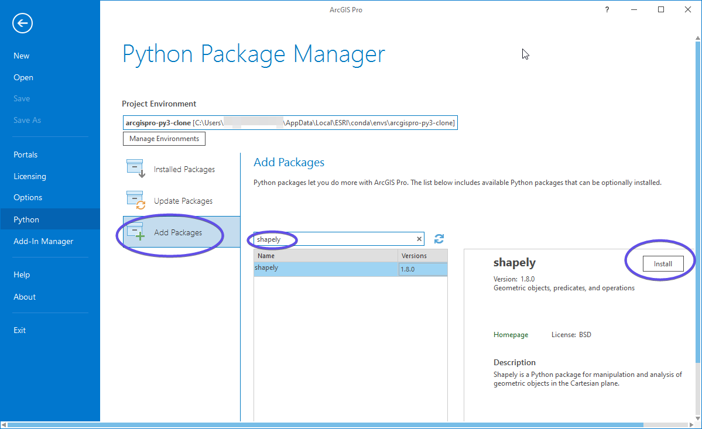
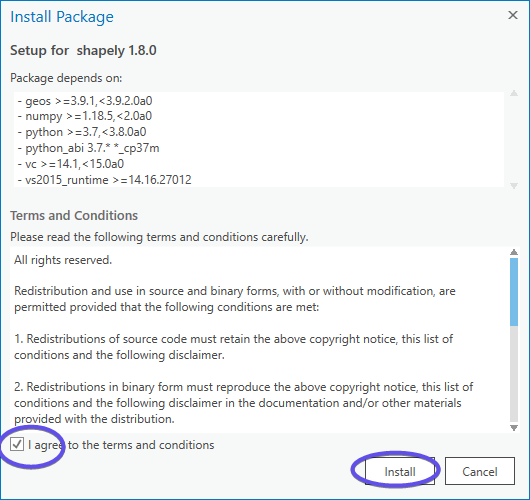

*************
Installation
*************

Forest Line Mapper is developed using Arcpy and other Python libraries. To use FLM, you need to install the proper Python environment first.

.. note::
    From 1.2, Forest Line Mapper no longer supports ArcMap. Only ArcGIS Pro is supported. ArcGIS Pro 2.7, 2.8 are tested.

ArcGIS Pro Python
================
ArcGIS Pro use Anaconda to mange the Python bindings. Default Anaconda is protected, so c clone of default Anaconda should be made by ArcGIS Pro to install third party libraries. For FLM, :class:`Shapely` is needed. Please follow the steps to install all the necessary parts.

Clone ArcGIS Python
-------------------
First, go to ArcGIS Pro `Settings`:

Click Python to get `Python Package Manager`:

Python Package Manager provides environment management and Python pacage management. Click `Manage Environments` to clone Anaconda. 

Click Clone Default, a new arcgispro-py3 clone will be created.

After a while the clone proces is done and a new environment called arcgispro-py3-clone will show up. Click the new environment to make it the default one. If you have ever create clones or add external Python environments, you'll see more options here.

Install Shapely
---------------
Once setup the proper Anaconda envrionment, we go to add package :class:`Shapely`

Make sure the correct environment is activated. Click ``Add Packages``. Search :class:`Shapely`, and install it. 

After installation, you might need to restart ArcGIS Pro to make the change take effect.

Run Forest Line Mapper
=======================

.. highlight:: bat

Forest Line Mapper can be launched by ForestLineMapper.bat in FLM root folder. Before launch FLM, open ForestLineMapper.bat in text editor to check the configuration is correct.:: 

    @echo off
    set scriptName=ForestLineMapper.py
    set pro=%PROGRAMFILES%\ArcGIS\Pro\bin\Python\Scripts\propy

If your ArcGIS Pro is istalled in another directory, do change the third line for the path. Now save the batch file and double click it, FLM will launch.