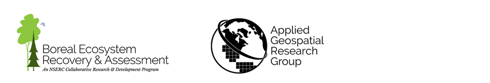

# Forest Line Mapper (FLM)
## A tool for enhanced delineation and attribution of linear disturbances in forests

*Copyright (C) 2021  Applied Geospatial Research Group*

# [FLM Installation](https://forest-line-mapper.readthedocs.io/en/latest/Installation.html)
FLM relys on Arcpy from ArGIS Pro to run. A clone of ArcGIS Pro Anaconda environment should be prepared to make sure FLM runs correctly.

# [FLM User Guide](http://flm.beraproject.org/)
Check the user guide for more information.

# [FLM Technical Documentation](https://forest-line-mapper.readthedocs.io/en/latest/)
FLM provides a series of tools for forest lines processing. Please refer to the technical documentation for programming APIs and algorithms details.

## Credits
This tool is part of the [**Boreal Ecosystem Recovery and Assessment (BERA)** Project](http://www.beraproject.org/), and was developed by the [**Applied Geospatial Research Group**](https://www.appliedgrg.ca/).

